# Loss-weight adaptation study

Planned: 2 independent runs per mode; 400 DE generations, at most 16168 Adam updates.

Maximum total loss evaluations per run: 29000. Actual costs are listed below.

| Mode | Completed / planned | Test RMSE (mean ± sample SD) | Training time (s) |
| --- | --- | --- | --- |
| de | 2 / 2 | 0.355176 ± 0.109379 | 516.4 |
| pinn | 2 / 2 | 0.292408 ± 0.019537 | 566.9 |
| both | 2 / 2 | 0.397615 ± 0.079058 | 464.1 |
| none | 2 / 2 | 0.28367 ± 0.0114584 | 559.2 |

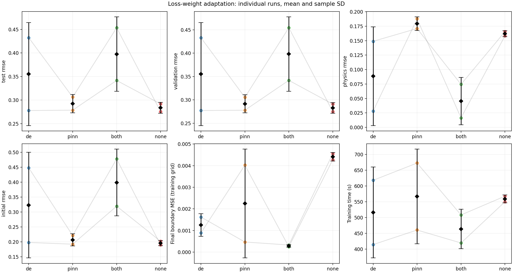

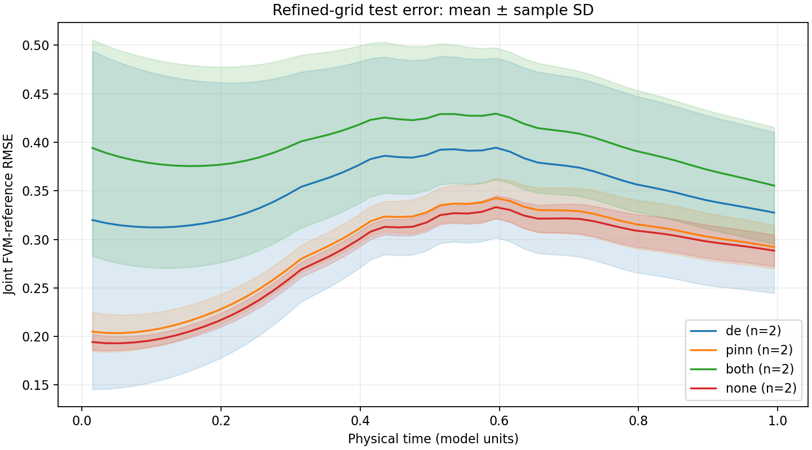

Comparison includes final raw boundary MSE on the training boundary grid; this is not an independent boundary-validation metric. Evaluations remain in the tables.

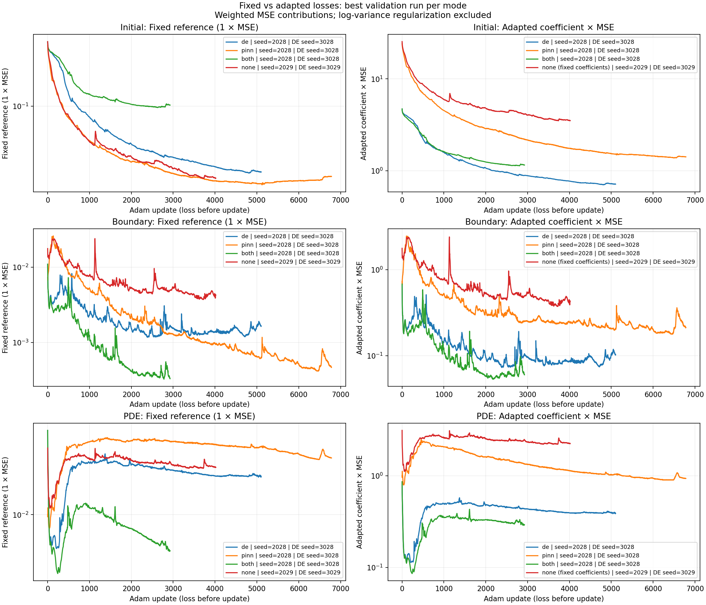

Each training-loss row pairs a common fixed 1:1:1 reference (left) with the actual coefficient times MSE (right). de uses DE-adapted coefficients frozen during Adam; pinn and both adapt them during Adam; none retains its configured fixed coefficients. Pre-update coefficients are reconstructed from the initial Adam log variances and the previous post-update weight snapshot. Curves use the best validation run per mode, selected once for all loss terms and coefficient plots; seeds appear in legends. These are weighted MSE contributions, excluding the additive log-variance regularizer in the adaptive objective.

Raw values and failed/pending attempts: [runs.csv](runs.csv). Aggregates: [summary.csv](summary.csv). Within-seed differences (left minus right): [paired_differences.csv](paired_differences.csv).

Only completed finite runs enter aggregates; incomplete counts are explicit. Each pair uses only seeds completed in both modes. No statistical significance is claimed. SD is undefined for one run. DE curves use arithmetic means across seeds at each step, restricted to the common prefix within each mode; no padding or changing cohort. Shaded bands show sample SD, not confidence intervals. Symmetric-log axes retain nonpositive bounds.

FVM is an approximate cell-based reference, compared with pointwise PINN predictions. Validation and test times are disjoint and never enter training. This is not an exact-solution error. Initial coefficients and fixed coefficients are recorded in each run metadata; historical studies may use different defaults. Equal maximum budgets need not yield equal executed budgets or time. Shared seeds do not make DE populations identical when genome dimensions differ.

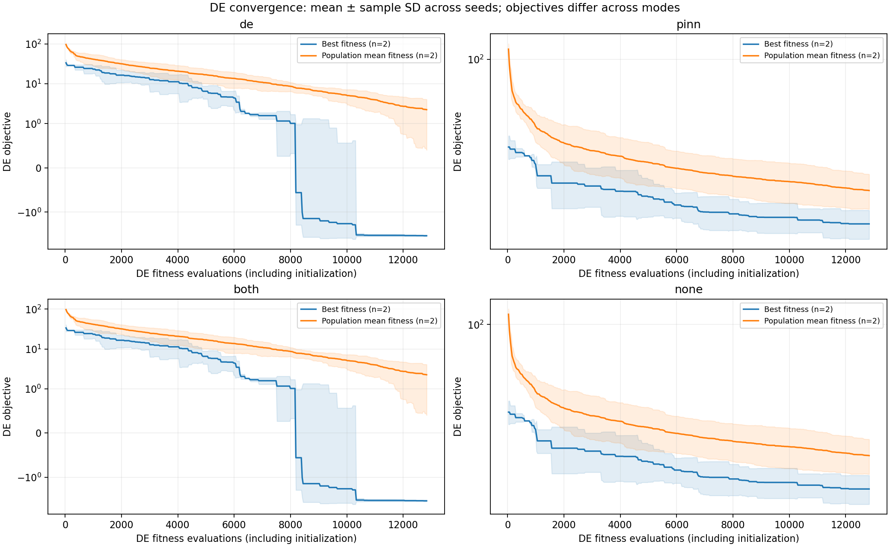

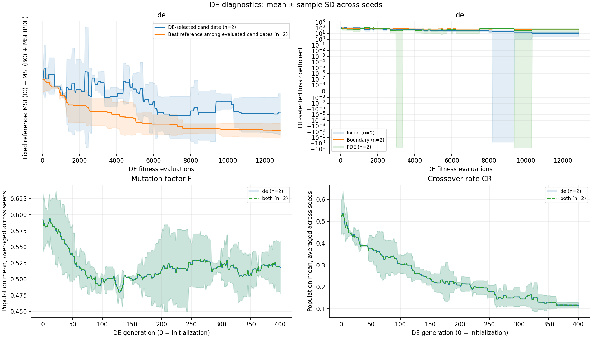

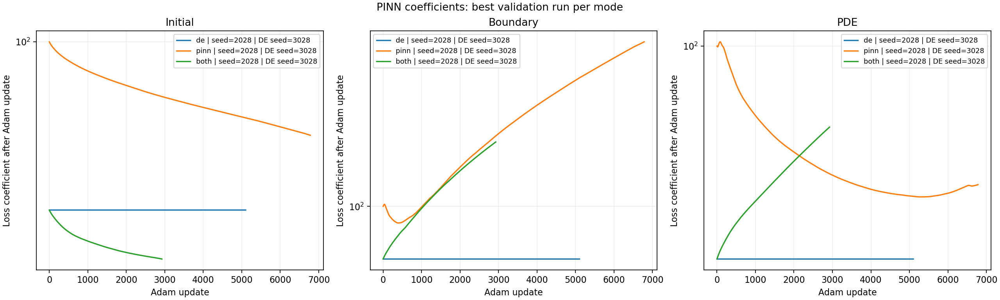

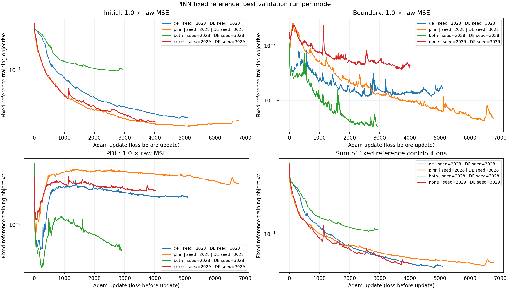

The PINN fixed-reference panels multiply each saved raw training MSE by the common post-hoc coefficient (Initial=1, Boundary=1, PDE=1). This matches the saved DE reference for de, pinn and both; none uses its recorded fixed coefficients for the original DE reference. The total is computed from the selected run, without averaging across seeds. This is the objective along the Adam trajectory, not a best-candidate search or validation error. All four modes appear in this reference comparison; none is omitted only from the coefficient plot. DE diagnostics retain the de reference and selected loss coefficients in the first row. The second row compares de and both: mean F and mean CR versus generation. Each run first averages over the population; curves then average those values across seeds. Bands show sample SD across seed means, not dispersion between individuals. Generation zero is initialization.

Plotted values, aggregation type, counts and seeds: [mean_histories.csv](mean_histories.csv).

Selected PINN runs: [selected_pinn_runs.json](selected_pinn_runs.json). Selection minimizes validation RMSE, with seed as the tie-breaker; test error is not used. These selected trajectories describe best-case runs, not average performance. Comparison statistics still include every completed finite run.

PINN weights are effective loss coefficients, not neural-network parameters. The de mode freezes DE-selected coefficients during Adam; pinn and both optimize them; none uses the recorded fixed coefficients. Raw training losses are measured before each update; Adam weight histories are recorded after each update. DE objectives differ between modes; use the common fixed-weight reference in the diagnostics for objective comparisons.

Representative fields place predictions in the first column and absolute errors in the second, with one model per row. The FVM reference occupies its own row. They use the first planned seed and the original training-grid FVM reference; tables use the refined reference. Missing modes are omitted, never replaced by a better seed.
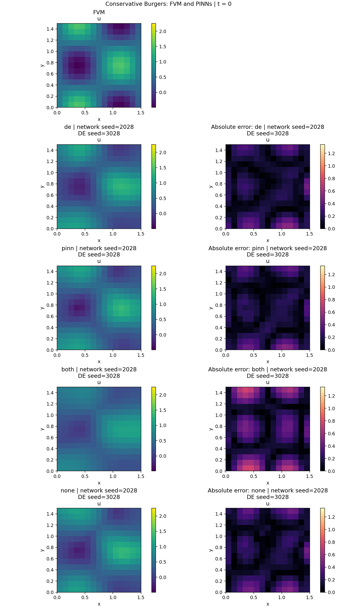
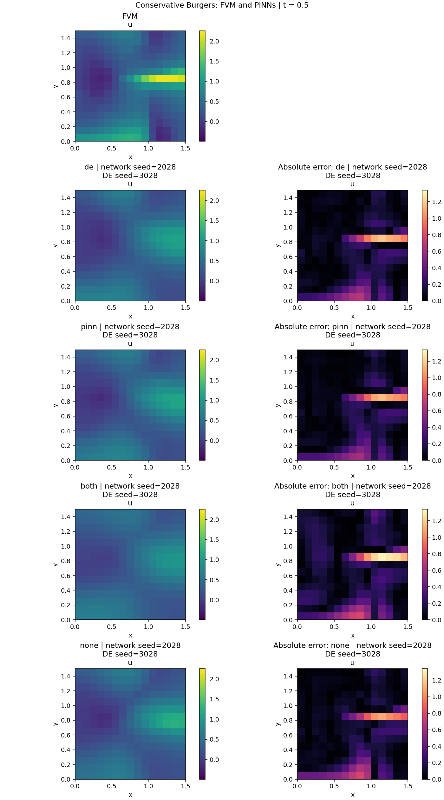
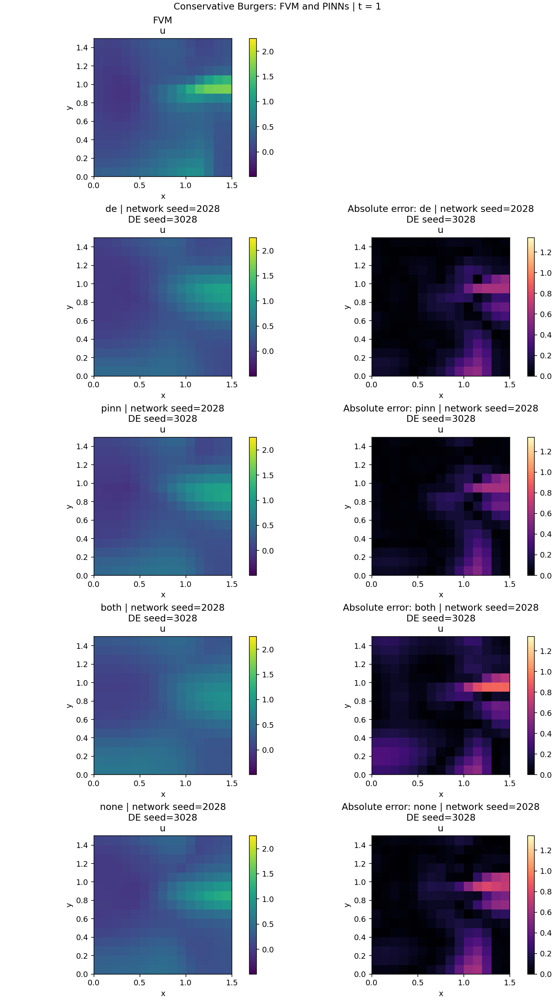
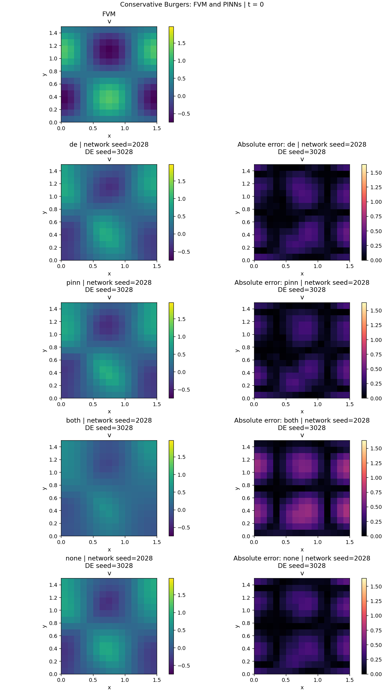
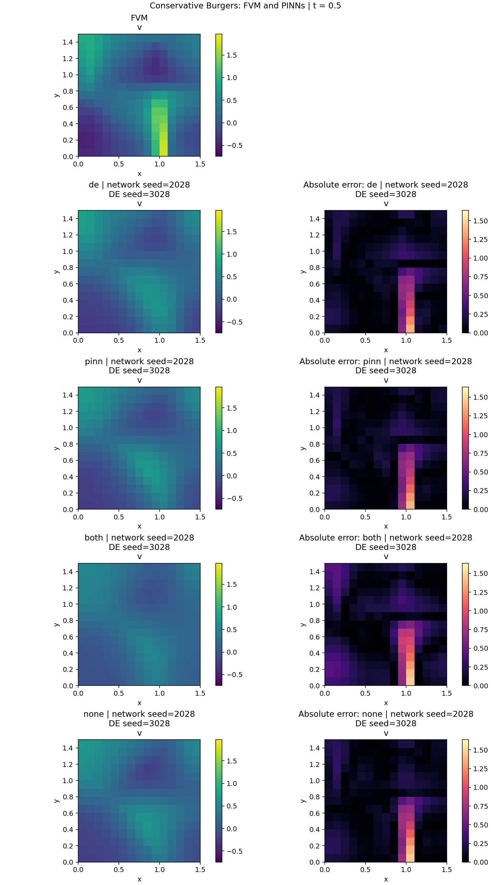
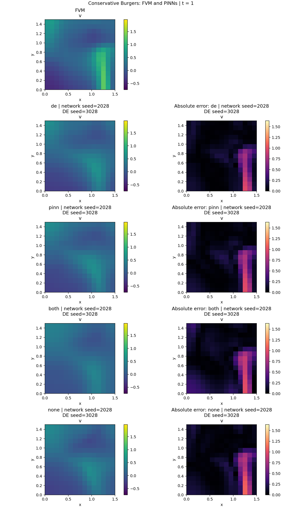
