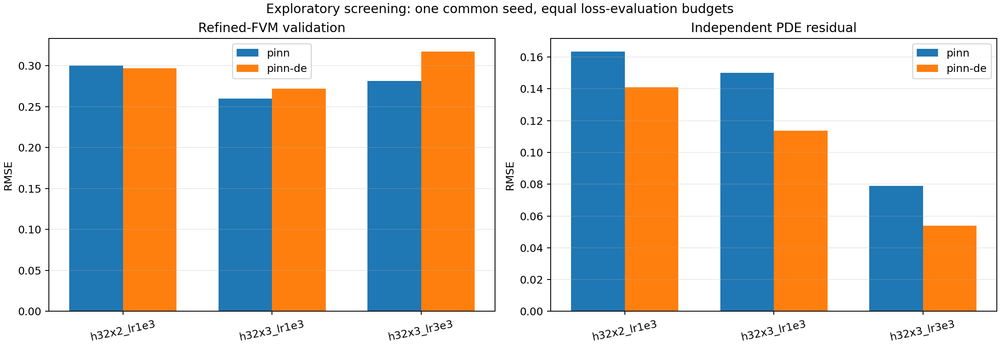
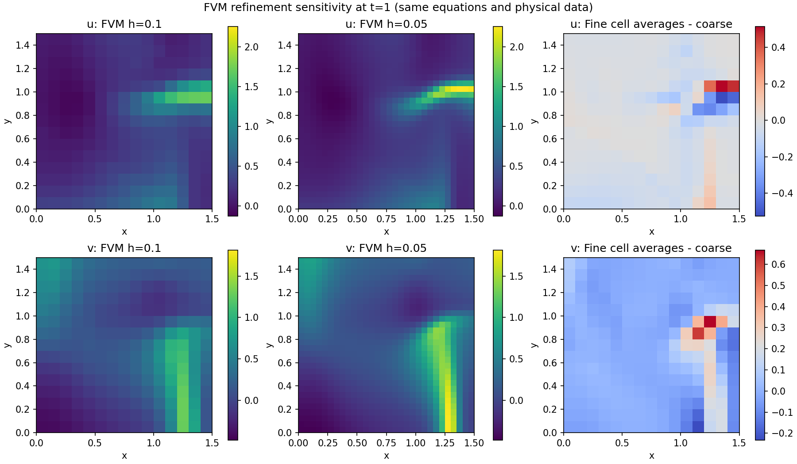
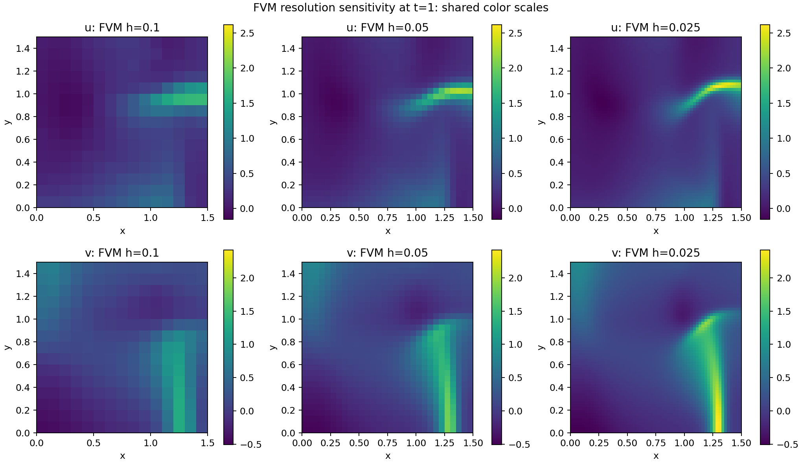
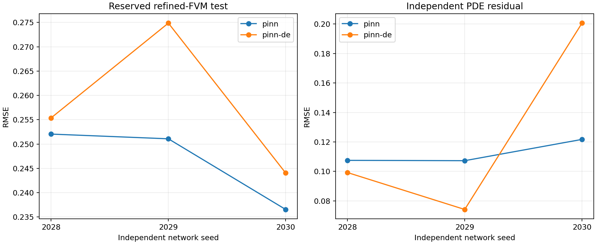
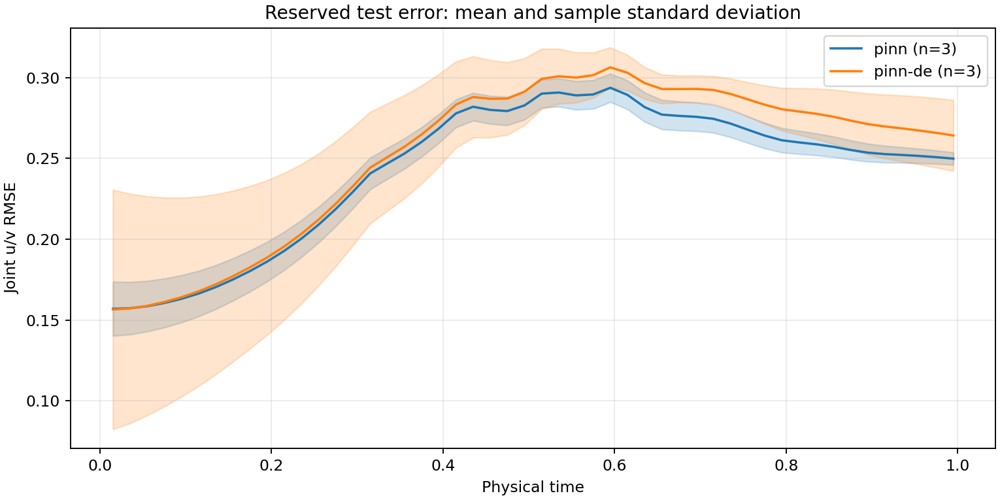
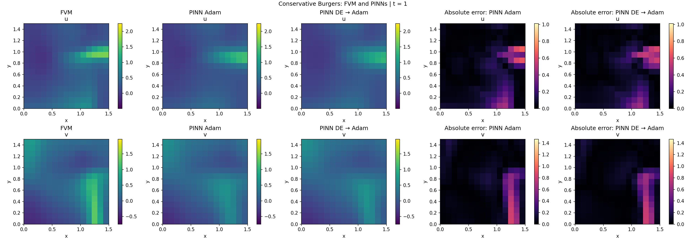
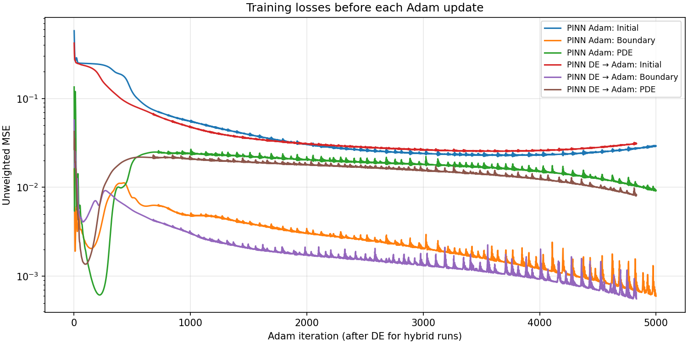
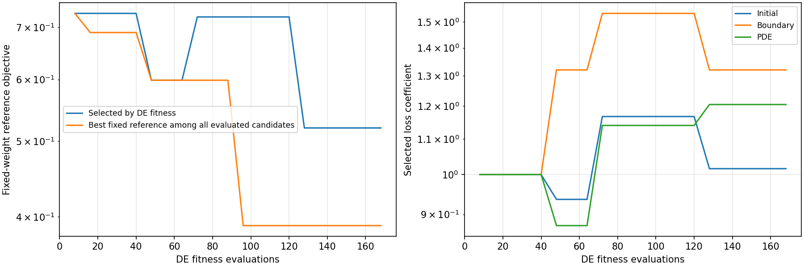
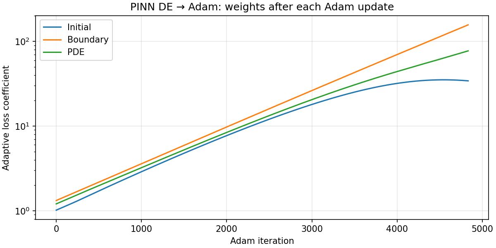

# Paired PINN / PINN-DE hyperparameter study

Status: all 12 planned runs completed. Screening is exploratory; confirmation reports all three independent seeds.

Training uses the unchanged conservative Burgers equations, physical constants, boundary and initial conditions, and the full original h=0.1, k=0.01 grid on [0,1] x [0,1.5] x [0,1.5]. Both methods use the same adaptive Initial/Boundary/PDE objective.

Every compared pair has exactly the same topology. Candidates have either two or three hidden layers with 32 neurons each. The selected topology is 3-32-32-32-2: three hidden layers, five layers including input and output.

The equations are `u_t + (u²/2)_x + (uv)_y = nu*(u_xx + u_yy)` and `v_t + (uv)_x + (v²/2)_y = nu*(v_xx + v_yy)`, with `nu=0.01`. Inputs are `(t,x,y)` and outputs `(u,v)`. The original sinusoidal initial fields and homogeneous Neumann faces are retained. Tanh networks use Xavier-uniform weights, zero biases, and input scaling to [-1,1]. There are 22,500 PDE, 225 initial, and 6,060 boundary points per full-batch evaluation. Fresh autograd leaves are generated every update, with no random subsampling or temporal curriculum.

Both methods use `sum_i(exp(-s_i)*MSE_i + s_i)`, for Initial, Boundary and combined two-component PDE losses. FisiocomPINN supplies `LOSS`, `FullyConnectedNetwork`, `Trainer` and `AdaptiveLossWeights`. The three log variances are optimized alongside the network by Adam; DE additionally evolves them as three genome coordinates. Negative adaptive objectives are permitted and do not by themselves indicate negative residual errors. The framework was not modified.

## Screening

Each run uses seed 2026 and 2,000 training loss evaluations. The DE branch uses population 8 and 20 generations (168 evaluations), followed by 1,832 Adam steps. PINN uses 2,000 Adam steps. Counts do not imply equal computational work: Adam also backpropagates; measured training time is retained.

The DE population contains **8 individuals**, and the search runs for **20 generations**. These are two different parameters, not a population range from 8 to 20. All six PINN-DE runs use the same population size and generation count; population size was not varied in this study. The settings below were checked against each run's saved metadata.

| Phase | Method | Runs | DE population (individuals) | DE generations | DE fitness evaluations per run | Adam updates per run | Total loss evaluations per run |
| --- | --- | ---: | ---: | ---: | ---: | ---: | ---: |
| Screening | PINN | 3 | N/A | N/A | 0 | 2,000 | 2,000 |
| Screening | PINN-DE | 3 | 8 | 20 | 168 | 1,832 | 2,000 |
| Confirmation | PINN | 3 | N/A | N/A | 0 | 5,000 | 5,000 |
| Confirmation | PINN-DE | 3 | 8 | 20 | 168 | 4,832 | 5,000 |

DE fitness evaluations include the initial population: `8 + 20 × 8 = 168`. Screening varies the network topology and Adam learning rate; confirmation varies the random seeds.

| Hidden layers | Learning rate | Method | Validation RMSE | Independent PDE RMSE | Initial RMSE | Training seconds |
| --- | ---: | --- | ---: | ---: | ---: | ---: |
| [32, 32] | 0.001 | pinn | 0.300474 | 0.163398 | 0.216798 | 87.5 |
| [32, 32] | 0.001 | pinn-de | 0.296967 | 0.141036 | 0.227152 | 75.2 |
| [32, 32, 32] | 0.001 | pinn | 0.260136 | 0.150196 | 0.178244 | 91.5 |
| [32, 32, 32] | 0.001 | pinn-de | 0.272188 | 0.113627 | 0.202703 | 95.0 |
| [32, 32, 32] | 0.003 | pinn | 0.281585 | 0.078979 | 0.225689 | 91.8 |
| [32, 32, 32] | 0.003 | pinn-de | 0.317299 | 0.053806 | 0.289487 | 89.1 |

Selection uses the minimum mean refined-FVM validation RMSE of the two methods, as recorded before screening. Selected: three hidden layers of 32 neurons, Adam learning rate 0.001. The rate 0.003 reduces PDE residual but worsens solution/initial-condition error in this screening; it was not selected.



## Validation protocol

The independent FVM reference uses h=0.05 and k=0.005. Validation uses time indices 1,5,...,197; reserved test uses 3,7,...,199. Both time sets and all reference cell centers differ from the training grid. Test metrics are evaluated only in confirmation. Initial error uses analytical initial fields on the refined spatial grid. PDE residuals use the same quarter-cell grid across both methods, with 21 evenly selected time cells spanning the full domain.

The reference is first-order FVM, not an exact solution. Averaging refined cell values onto the coarse grid gives refinement discrepancies stored in reference_sensitivity.json; these differences must not be mistaken for PINN errors alone. The inherited sinusoidal initial fields also do not satisfy every homogeneous Neumann boundary condition at t=0. Physical assumptions were preserved.

A further reference-only check uses h=0.025, k=0.00125. Differences between the h=0.05 and h=0.025 solutions, after conservative spatial restriction at matching times, are RMSE 0.081013 for u and 0.090535 for v. These are not model errors or rigorous error bounds. Reference convergence has not been established; this limits claims about absolute solution accuracy. Neither this extra reference nor reserved test errors were used to retune the selected configuration.





## Confirmation

All six confirmation runs completed. Network seeds are 2028, 2029 and 2030; DE seeds are 3028, 3029 and 3030. Each run uses 5,000 training loss evaluations. All six screening runs also completed, for 12 runs total and zero failed runs. Values below are means ± sample standard deviations across three independent runs. RMSE jointly averages u and v squared errors before taking the square root.

| Method | Validation RMSE | Reserved test RMSE | Independent PDE RMSE | Initial RMSE | Training seconds |
| --- | ---: | ---: | ---: | ---: | ---: |
| pinn | 0.245770 ± 0.008774 | 0.246557 ± 0.008680 | 0.112181 ± 0.008270 | 0.157559 ± 0.017072 | 252.1 ± 7.8 |
| pinn-de | 0.257235 ± 0.016203 | 0.258089 ± 0.015586 | 0.124687 ± 0.066915 | 0.157038 ± 0.076131 | 245.9 ± 8.4 |

Individual reserved-test results:

| Network seed | PINN test RMSE | PINN-DE test RMSE | DE minus PINN |
| ---: | ---: | ---: | ---: |
| 2028 | 0.252045 | 0.255369 | +0.003324 |
| 2029 | 0.251076 | 0.274855 | +0.023779 |
| 2030 | 0.236550 | 0.244041 | +0.007491 |

PINN has lower reserved-test RMSE in all three paired seeds. The mean paired difference (DE minus PINN) is 0.011532, or 4.68% of PINN mean RMSE. This small descriptive study does not establish statistical significance or superiority across other problems and budgets. DE does not demonstrate a solution-accuracy benefit here. Its PDE residual improves in two seeds but deteriorates in seed 2030; averaging only the first two would have been misleading. No seed was discarded.

The mean reserved-test error rises toward t≈0.6 and then declines. PINN-DE has a wider across-seed band, especially near the initial time, consistent with its larger variation in initial-condition error. The band is sample standard deviation, not a confidence interval.





For historical context only, the previous five-hidden-layer, seed-2026 runs have common-protocol validation RMSE 0.237527 (PINN) and 0.240492 (PINN-DE), stored in historical_validation.json. The new three-layer means do not improve those historical values. The historical runs have different seeds and unequal original computational budgets, so this is not a controlled architecture comparison. The selected smaller profile is the best of the three screened configurations, not a demonstrated accuracy improvement over every existing model.

## Reading the representative plots

The representative pair uses the first preassigned confirmation seed, 2028. It was not chosen by its observed accuracy. The standard plots below use the original h=0.1 FVM comparison saved by the training entry points; their numerical errors therefore differ from the refined-reference validation/test tables above.

- At t=1, both networks reproduce broad field patterns but smooth the narrow structures near the right boundary. The largest discrepancies concentrate around those structures, especially the lower-right v field. This observation compares approximations, not either method against an exact solution.
- Unweighted Initial loss decreases and then rises late in Adam while Boundary and PDE losses continue improving. Boundary loss also shows repeated spikes. The adaptive objective therefore trades off the terms; decreasing it alone does not demonstrate improving solution accuracy.
- All three coefficients change during Adam. In the DE history, the selected network's fixed-weight residual sum can rise when the adaptive objective improves. Its curve is distinct from the best fixed-reference residual seen among all candidates. The seed-2028 DE best adaptive objective falls from 0.729460 to 0.073761; the selected fixed-reference sum falls from 0.729460 to 0.519923, while the best fixed-reference sum seen is 0.389580. This run does not support a claim that DE fitness is stuck, and it also does not establish a downstream advantage over Adam alone.









## Recommended configuration and scope

Use three hidden layers of 32 neurons and Adam learning rate 0.001 for this recorded small-network comparison. DE uses a fixed population of 8, 20 generations, local initial spread 0.05, and jDE control proposals with probability 0.1. The screening optimized topology and learning rate among three candidates; it did not independently optimize every DE control or establish a global optimum. Equal loss-evaluation counts do not imply equal floating-point work.

The CLI defaults and shared trainer now use the selected three-hidden-layer topology (2,306 network parameters, plus three adaptive log variances). PINN-DE CLI defaults also use population 8, 20 DE generations and 4,832 Adam updates. These defaults were changed after every experiment finished; training source snapshots preserve the code used for the runs.

The reproducible paired preset executes PINN with 5,000 Adam updates and PINN-DE with 168 DE evaluations followed by 4,832 Adam updates:

```bash
conda activate torch-numba-11
bash work_4/run_recommended_pair.sh
# Optional independent repeat:
NETWORK_SEED=2029 bash work_4/run_recommended_pair.sh
```

The preset reads the current `work_4/control_dicts` files. The configuration snapshot in this study is authoritative for reproducing the reported physical problem. Exact original commands are retained in phase records. Runs used CUDA float32 on an NVIDIA GeForce GTX 1650 (4 GiB), PyTorch 2.5.1, with OMP/MKL thread counts of one. Framework commit and source hashes are recorded in the manifest. Seeds control random streams; cross-platform bitwise reproducibility is not asserted.

## Reproduction and raw artifacts

- manifest.json: configuration, budget, seeds, selection rule and source hashes.
- config/: original physical training JSON files.
- runs/: raw models, losses, DE populations, adaptive weights, FVM comparisons and independent evaluations.
- logs/: exact training output; exact commands are stored in phase records.
- screen_records.json / screen_table.csv: all exploratory results.
- run_paired_study_snapshot.py: screening orchestration snapshot.
- confirmation_runner_snapshot.py: confirmation orchestration snapshot.
- training_source_snapshot/: training implementation before any post-study CLI default changes.
- previous_plots/: historical model comparison; these old runs have different original budgets and five hidden layers.

```bash
python work_4/analyze_paired_study.py work_4/studies/pinn_pair_1788963619775820198
```

## Code verification

All 48 existing tests pass after the post-study default changes, including manufactured-residual, adaptive-weight handoff, genome/budget, plot-artifact and reduced CPU float64 end-to-end smoke tests. The first run exposed a pre-existing test assumption that a single generation must improve a 512-dimensional sphere. The control-adaptation test now uses one active objective coordinate in the same large genome to exercise accepted and rejected controls with a fixed seed. The production DE algorithm was not changed. Both the original failing log and the final passing log are retained.

Python compilation, shell syntax, paired-command argument dry-run, matching CLI topology/budgets, all 12 raw-run budgets and disjoint validation/test time indices were checked. These checks are separate from the full-domain GPU accuracy experiments. See verification.json for the audit and post-study source hashes.
