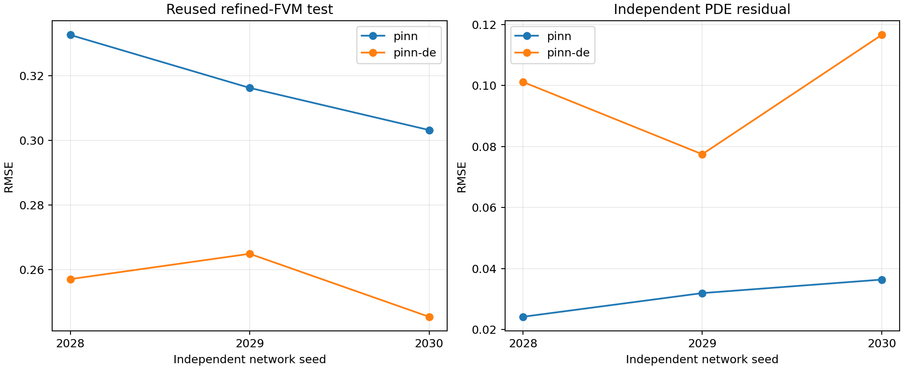
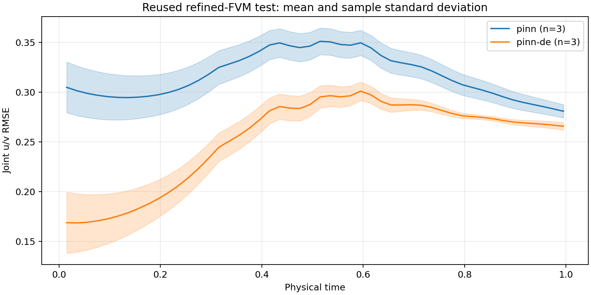
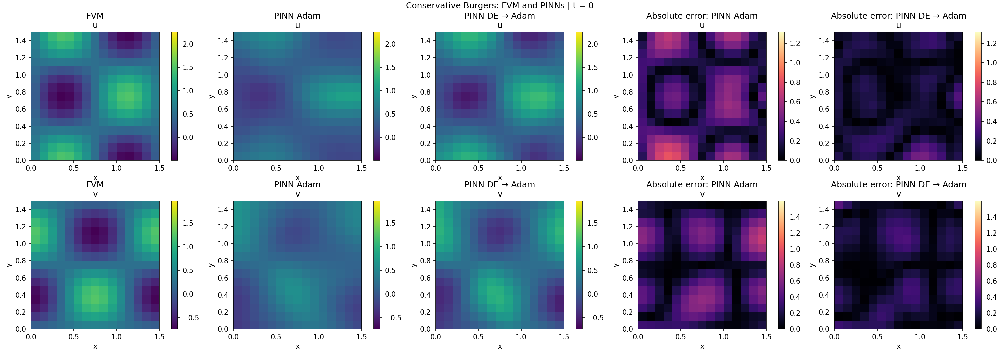
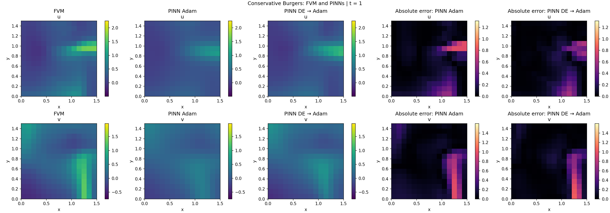
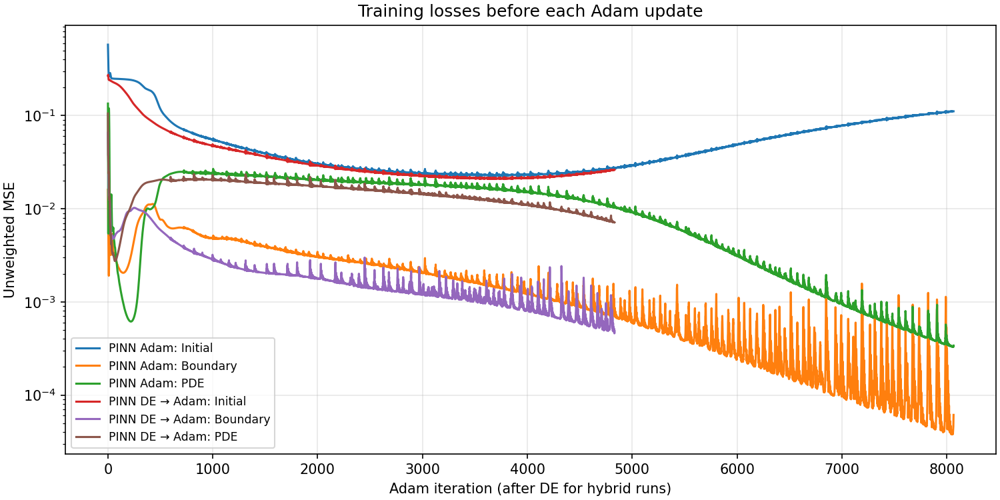
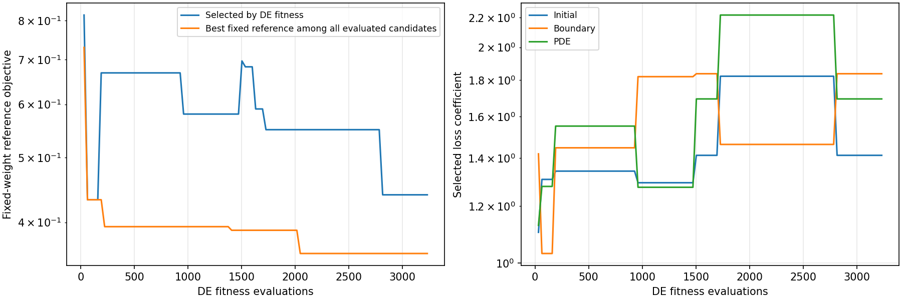

# PINN and PINN-DE for conservative Burgers equations

This experiment compares Adam training with Differential Evolution followed by Adam. Both methods use the same network and adaptive loss formula. All six runs completed without failures: three independent network seeds for each method.

## Physical problem

Network inputs are `(t,x,y)` and outputs are the velocity components `(u,v)`. The implemented equations are:

```text
u_t + (u²/2)_x + (uv)_y = nu * (u_xx + u_yy)
v_t + (uv)_x + (v²/2)_y = nu * (v_xx + v_yy)
```

The domain is `t ∈ [0,1]`, `x,y ∈ [0,1.5]`, with viscosity `nu=0.01`. Initial conditions are:

```text
u(0,x,y) = 0.5 + sin(2*pi*x/1.5) * cos(2*pi*y/1.5)
v(0,x,y) = 0.25 - cos(2*pi*x/1.5) * sin(2*pi*y/1.5)
```

Both components have homogeneous Neumann conditions on all four spatial faces. No physical parameters are inferred, and no observational or FVM targets enter training. Inputs are scaled to [-1,1] inside the network; derivatives are taken with respect to physical coordinates.

## Network and training configuration

| Parameter | PINN | PINN-DE |
| --- | --- | --- |
| Topology | 3 → 32 → 32 → 32 → 2 | 3 → 32 → 32 → 32 → 2 |
| Hidden layers | 3, with 32 neurons each | 3, with 32 neurons each |
| Activation | Tanh | Tanh |
| Network parameters | 2,306 | 2,306 |
| Initialization | Xavier-uniform weights, zero biases | Same network initialization; local DE population |
| Adam learning rate | 0.001 | 0.001 |
| Adam betas | (0.9, 0.999) | (0.9, 0.999) |
| Network seeds | 2028, 2029, 2030 | 2028, 2029, 2030 |
| DE seeds | N/A | 3028, 3029, 3030 |
| Adaptive loss terms | Initial, Boundary, PDE | Initial, Boundary, PDE |
| Device and precision | CUDA float32 | CUDA float32 |

The experiment uses FisiocomPINN `FullyConnectedNetwork`, `LOSS`, `Trainer` and `AdaptiveLossWeights`, with PyTorch 2.5.1 on an NVIDIA GeForce GTX 1650 (4 GiB). OMP and MKL thread counts are one. The framework commit is `ee4a05e01c4374d36ad19a3a6cc7266d8d441620`; source hashes are retained in manifest.json.

Training uses a deterministic grid with `h=0.1` and `k=0.01`. Every update evaluates all 22,500 PDE points, 225 initial points and 6,060 boundary points. Fresh autograd leaves are generated each iteration; there is no random minibatching or temporal curriculum.

### Adaptive objective and DE operators

Both methods minimize `L = sum_i(exp(-s_i)*MSE_i + s_i)`, where i indexes Initial, Boundary and the combined two-component PDE residual. Adam updates the network and all three log variances. The PDE MSE averages both residual columns.

The DE chromosome has 2,309 genes: all network weights and biases plus three log variances. Fitness is the same deterministic full-batch adaptive objective. No Adam training occurs inside a fitness evaluation. The best DE individual initializes Adam, which continues adapting the network and all three log variances.

DE uses synchronous DE/rand/1/bin, three distinct donors excluding the target, binomial crossover with one forced mutant coordinate, and strict-improvement replacement. Each individual carries F in [0.3,0.9] and CR in [0,1]. Each control independently has probability 0.1 of receiving a jDE-style proposal; accepted trials retain the proposed controls.

One individual is the initialized network. Other individuals use local spread 0.05: network perturbations within ±0.2 and log-variance perturbations within ±0.4. Network genes are bounded by [-2,2] during DE. Log variances are unbounded after finite initialization. Adam is unconstrained by the DE network bounds.

### Evaluation budgets

| Method | Runs | DE individuals | DE generations | DE evaluations per run | Adam updates per run | Total training loss evaluations per run |
| --- | ---: | ---: | ---: | ---: | ---: | ---: |
| PINN | 3 | N/A | N/A | 0 | 8,064 | 8,064 |
| PINN-DE | 3 | 32 | 100 | 3,232 | 4,832 | 8,064 |

DE includes the initial population evaluation: `32*(100+1)=3232`. Stopping uses these fixed schedules. Adam also backpropagates, so equal evaluation counts do not imply equal computational work. Diagnostic and validation evaluations are outside this training budget.

## Evaluation protocol

A first-order donor-cell FVM solution with `h=0.05`, `k=0.005` supplies an approximate numerical reference. Each split evaluates 45,000 points on its 30×30 spatial grid:

- Validation times: 0.005, 0.025, …, 0.985.
- Test times: 0.015, 0.035, …, 0.995.

The time sets are disjoint, and both their times and spatial cell centers differ from training points. These test coordinates had been inspected before this experiment; they are not a fresh blinded holdout. Their FVM targets do not enter training.

The joint test RMSE is `sqrt(sum_j((u_j-u_j_FVM)^2 + (v_j-v_j_FVM)^2)/(2*N))`. Lower values indicate closer agreement with the numerical reference, not necessarily lower error against an exact solution.

Independent PDE RMSE evaluates both conservative residuals at 4,725 quarter-cell-offset points, with 21 selected time cells spanning the full time domain. Initial RMSE compares predictions with the analytical initial fields at the 900 refined spatial centers.

## Results

Values are means ± sample standard deviations over three independent seeds. No run was discarded.

| Method | Validation RMSE | Test RMSE | PDE RMSE | Initial RMSE |
| --- | --- | --- | --- | --- |
| PINN | 0.317626 ± 0.014917 | 0.317388 ± 0.014733 | 0.030829 ± 0.006168 | 0.308117 ± 0.025918 |
| PINN-DE | 0.255028 ± 0.010046 | 0.255862 ± 0.009800 | 0.098389 ± 0.019697 | 0.169772 ± 0.031687 |

| Method | DE time (s) | Adam time (s) | Total training time (s) |
| --- | --- | --- | --- |
| PINN | 0.0 ± 0.0 | 397.0 ± 20.0 | 397.0 ± 20.0 |
| PINN-DE | 83.8 ± 1.5 | 242.8 ± 5.2 | 326.6 ± 3.8 |

### Individual results

| Seed | PINN test RMSE | PINN-DE test RMSE | PINN PDE RMSE | PINN-DE PDE RMSE |
| --- | --- | --- | --- | --- |
| 2028 | 0.332645 | 0.257134 | 0.024181 | 0.101162 |
| 2029 | 0.316277 | 0.264964 | 0.031941 | 0.077453 |
| 2030 | 0.303241 | 0.245488 | 0.036365 | 0.116553 |





### Interpretation

PINN-DE has lower test RMSE in all three paired seeds. It also has lower mean initial-condition error and training time, while PINN has lower independent PDE residual. These metrics describe different aspects of the approximation; lower PDE residual alone does not guarantee closer agreement with the FVM solution.

The mean test-error curves rise toward the middle of the time domain and then decline. PINN-DE has lower mean test error throughout the sampled time range. Shaded bands show sample standard deviations, not confidence intervals.

Three seeds support descriptive comparisons; no statistical-significance claim or globally optimal hyperparameter configuration is established.

## Field plots and training losses

Seed 2028 was designated for representative plots before training. These field plots use an h=0.1 FVM grid, whereas validation/test tables use h=0.05. Their numerical errors therefore need not match.

At t=0, PINN attenuates the imposed spatial variations more than PINN-DE. At t=1, both smooth narrow structures near the right boundary, with larger discrepancies for PINN in this displayed seed.





The initial-condition training loss turns upward late in Adam while Boundary and PDE losses decrease. The corresponding adaptive coefficients increasingly favor the latter terms. The horizontal axis below counts Adam updates: 8,064 for PINN and 4,832 after DE for the hybrid.



## DE diagnostics

All three DE runs lowered their best adaptive fitness and accepted control-parameter adaptations. This demonstrates activity of the search, not global convergence or solution accuracy.

| Seed | Individuals | Generations | Initial best fitness | Final best fitness | Accepted trials | Accepted control proposals |
| --- | --- | --- | --- | --- | --- | --- |
| 2028 | 32 | 100 | 0.364837 | -0.802488 | 218 | 44 |
| 2029 | 32 | 100 | -0.119853 | -0.792848 | 199 | 32 |
| 2030 | 32 | 100 | 0.368961 | -0.743070 | 204 | 39 |



The fixed-reference objective in the left panel is the unweighted Initial + Boundary + PDE loss. The selected individual minimizes adaptive fitness, so its fixed-reference loss can increase between generations. The best fixed-reference loss seen among evaluated candidates is tracked separately. The right panel shows the three coefficients of the selected individual.

### Mathematical check of the adaptive objective

A separate untrained constant-network check, using the same loss implementation and physical grid, gives `Initial MSE=0.25`, `Boundary MSE=0` and `PDE MSE=0` for `u=0.5`, `v=0.25`. With `s_Initial=0` and `s_Boundary=s_PDE=-k`, the adaptive objective is `0.25-2k`.

| k | Initial MSE | Boundary MSE | PDE MSE | Adaptive objective |
| --- | --- | --- | --- | --- |
| 0 | 0.25 | 0 | 0 | 0.25 |
| 5 | 0.25 | 0 | 0 | -9.75 |
| 10 | 0.25 | 0 | 0 | -19.75 |
| 20 | 0.25 | 0 | 0 | -39.75 |

The objective is unbounded below along this explicit path despite the incorrect initial condition. This property applies to both methods. It does not prove that a trained network converges to an exactly constant field. This diagnostic is separate from the six training runs.

## Limitations

- FVM is an approximate reference; mesh convergence has not been established. Reported discrepancies are not exact physical solution errors.
- The sinusoidal initial fields do not satisfy every homogeneous Neumann face at t=0. Both methods use this same formulation.
- Test coordinates were inspected before this experiment; this is a descriptive evaluation on a reused test set.
- Three seeds and one fixed configuration per method do not establish statistical significance or isolate the separate effects of population size and generation count.

## Reproduction and artifacts

From the repository root, activate the environment and run one paired seed:

```bash
conda activate torch-numba-11
bash work_4/run_de32_pair.sh
# Additional seeds:
NETWORK_SEED=2029 bash work_4/run_de32_pair.sh
NETWORK_SEED=2030 bash work_4/run_de32_pair.sh
```

The preset reads work_4/control_dicts; config/ contains the authoritative physical snapshot for this experiment. The hybrid CLI uses `--epochs 4932 --de-generations 100 --population-size 32`: epochs counts 100 generation slots plus 4,832 Adam updates, not fitness evaluations.

Regenerate this experiment's numerical summaries and this document without training:

```bash
python work_4/analyze_paired_study.py work_4/studies/pinn_pair_de32_g100_1788968487925081526
python work_4/studies/pinn_pair_de32_g100_1788968487925081526/build_report.py
```

- [Per-run results](confirm_table.csv) and [summary statistics](confirmation_summary.csv).
- [DE diagnostics for the three seeds](experiment_de_diagnostics.csv).
- [Constant-field diagnostic source](constant_field_objective_check.py) and [numerical results](constant_field_objective_check.json).
- config/ records physical parameters; runs/ contains model checkpoints, optimizer/adaptive states, losses and evaluations; logs/ contains training output.
- manifest.json records schedules, seeds, environment and source hashes. Training used FisiocomPINN without framework modifications.
- All six runs completed, with finite evaluation metrics and no nonfinite DE fitness evaluations. Full-grid preflight loss checks, the 8,064-evaluation budgets, shared topology, source integrity and the independent CPU objective diagnostic were verified.
